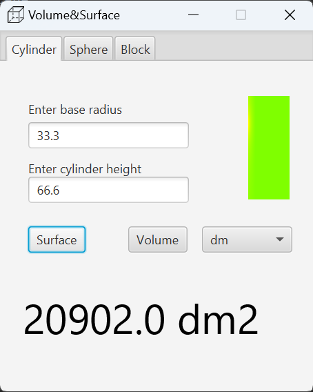

# JavaFX-Volume-Surface
App that calculate volume and surface of cylinder, sphere and block

# JavaFX 3D Geometry Calculator

## Description

This JavaFX application is a 3D geometry calculator that allows users to calculate the volume and surface area of three common geometric shapes: cylinder, sphere, and block.

## Features

- **Calculate Volume and Surface Area:** Compute the volume and surface area for cylinders, spheres, and blocks.

- **JavaFX User Interface:** The application features a graphical user interface built using JavaFX for a user-friendly experience.

## Getting Started

### Prerequisites

- Java Development Kit (JDK) installed
- [Other dependencies...]

### Installation

1. Clone the repository: git clone https://github.com/<your_username>/JavaFX-Volume-Surface.git

